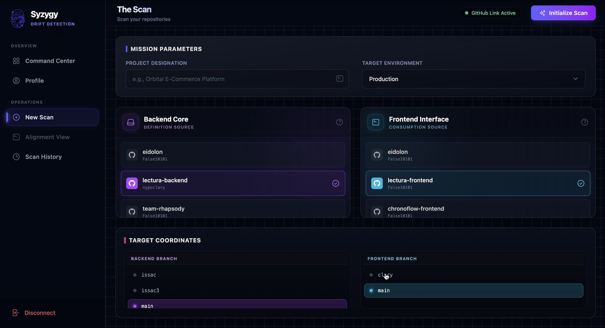
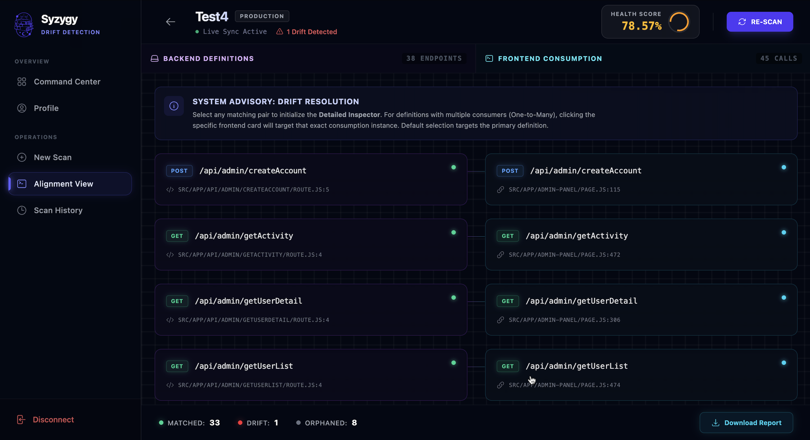
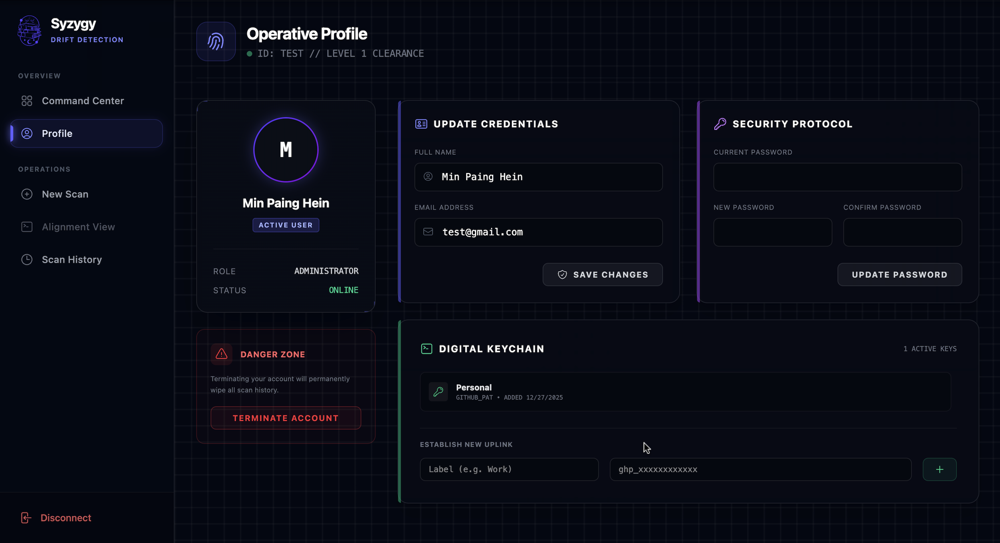
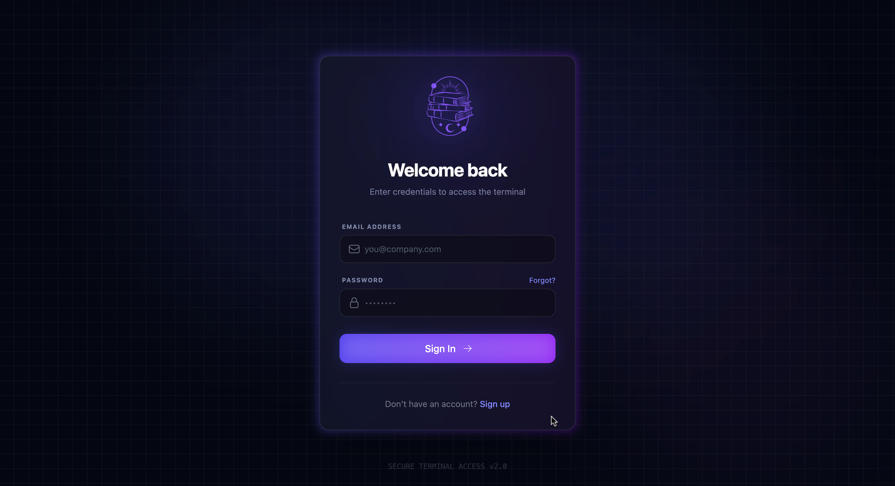

# 🌑 Syzygy

> **Align your Stack.** Automated API drift detection and full-stack synchronization analysis.


## 📖 Overview

**Syzygy** is a developer tool designed to detect **API Drift**—the "silent killer" of modern web applications where frontend consumption falls out of sync with backend definitions.

Unlike traditional tools that rely on runtime traffic (OpenTelemetry) or manual documentation (Swagger/OpenAPI), Syzygy performs **Static Code Analysis** on your GitHub repositories. It parses source code to extract API definitions and consumption patterns, calculating a "Health Score" based on route alignment.

### 🚀 Key Features

* ** automated Drift Detection:** Scans repository zipballs to identify orphaned endpoints, method mismatches, and typo-induced errors.
* **AST-based Parsing:** Custom Regex and logic to parse Express.js, Flask, Next.js, and React `fetch` calls without running the code.
* **Fuzzy Matching Algorithm:** Implements Levenshtein distance to detect probable matches despite typos (e.g., `/usr/profile` vs `/user/profile`).
* **Secure Digital Keychain:** Manages multiple GitHub Personal Access Tokens (PAT) using **AES-256-CBC encryption** at rest.
* **Visual Alignment:** "Midnight Cyberpunk" UI for visualizing the gap between defined routes and consumed endpoints.

---

## 📸 Screenshots

| Dashboard & History | New Scan Interface |
|:-------------------------:|:-------------------------:|
|  |  |

| Indepth Drift Explanation |  Drift Analysis |
|:-------------------------:|:-------------------------:|
|  |  | 

| Secure Profile | Login |
|:-------------------------:|:-------------------------:|
|  |  |

---

## 🛠️ Tech Stack

**Frontend**
* **Framework:** React (Vite)
* **Styling:** Tailwind CSS (Custom "Midnight" Design System)
* **Icons:** Heroicons
* **State/Routing:** React Router DOM, Context API

**Backend**
* **Runtime:** Node.js & Express
* **Database:** MySQL (Relational data for Users, Projects, Scans, Credentials)
* **GitHub Integration:** Octokit REST API
* **Analysis:** `adm-zip` for in-memory extraction, custom Regex parsers.
* **Security:** Node `crypto` module (AES-256).

---

## ⚙️ Architecture & Logic

### 1. The Scanning Engine
The core of Syzygy is the scan logic located in `server/routes/scan.js`:
1.  **Fetch:** Downloads repository source code as a zipball via GitHub API.
2.  **Extract:** Unzips in-memory (no disk writes for speed/security).
3.  **Parse:** Iterates through files matching specific patterns (`.js`, `.ts`, `.py`).
    * *Backend Parser:* Looks for `app.get()`, `@app.route()`, `router.post()`.
    * *Frontend Parser:* Looks for `fetch()`, `axios.get()`.
4.  **Align:** The `utils.js` module maps definitions to consumptions using exact matching and fuzzy logic.

### 2. Security Protocol
User tokens are never stored in plain text.
* **Algorithm:** AES-256-CBC
* **Implementation:** A unique 32-byte `ENCRYPTION_KEY` is used to encrypt tokens before DB insertion. Tokens are decrypted only momentarily in RAM during a scan request.

---

## ⚡ Getting Started

### Prerequisites
* Node.js (v16+)
* MySQL Server
* A GitHub Personal Access Token (for local testing)

### 1. Clone the Repository
```bash
git clone [https://github.com/YOUR_USERNAME/syzygy.git](https://github.com/YOUR_USERNAME/syzygy.git)
cd syzygy